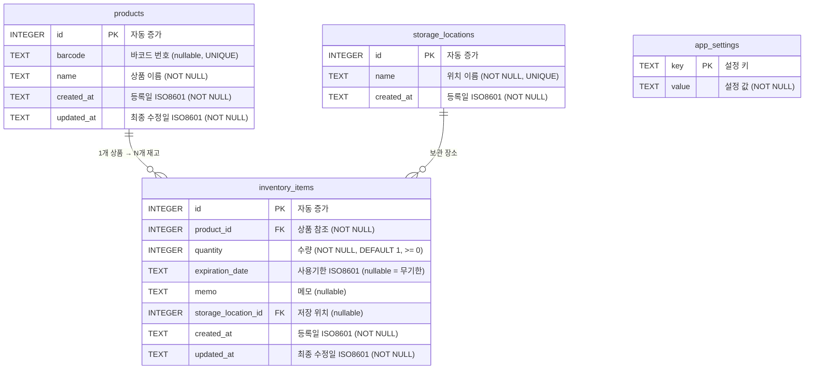

# ERD — 가정용 소모품 재고 관리 앱

## 1. ER 다이어그램 (Mermaid)

## 2. 테이블 상세

### 2.1 products

상품 마스터 테이블. 바코드 또는 이름으로 식별되는 상품의 기본 정보를 저장한다.

| 컬럼 | 타입 | 제약조건 | 설명 |
|------|------|---------|------|
| id | INTEGER | PK, AUTOINCREMENT | 고유 식별자 |
| barcode | TEXT | UNIQUE, nullable | 바코드 번호. 공산품에만 존재. |
| name | TEXT | NOT NULL | 상품 이름 |
| created_at | TEXT | NOT NULL | 등록 시각 (ISO 8601) |
| updated_at | TEXT | NOT NULL | 최종 수정 시각 (ISO 8601) |

**인덱스:**
- `idx_products_barcode` — barcode 컬럼 (바코드 스캔 검색)
- `idx_products_name` — name 컬럼 (이름 텍스트 검색)

### 2.2 inventory_items

개별 재고 항목 테이블. 동일 상품이라도 구매 시기, 구매처, 사용기한이 다르면 별도 행으로 관리한다.

| 컬럼 | 타입 | 제약조건 | 설명 |
|------|------|---------|------|
| id | INTEGER | PK, AUTOINCREMENT | 고유 식별자 |
| product_id | INTEGER | FK → products(id), NOT NULL | 소속 상품 |
| quantity | INTEGER | NOT NULL, DEFAULT 1, CHECK(quantity >= 0) | 현재 수량 |
| expiration_date | TEXT | nullable | 사용기한 (ISO 8601). NULL이면 무기한. |
| memo | TEXT | nullable | 자유 텍스트 메모 (구매처, 구매일 등) |
| storage_location_id | INTEGER | FK → storage_locations(id), nullable | 저장 위치. NULL이면 미지정. |
| created_at | TEXT | NOT NULL | 등록 시각 (ISO 8601) |
| updated_at | TEXT | NOT NULL | 최종 수정 시각 (ISO 8601) |

**인덱스:**
- `idx_inventory_items_product_id` — product_id 컬럼 (상품별 재고 조회)
- `idx_inventory_items_expiration_date` — expiration_date 컬럼 (임박/만료 조회)
- `idx_inventory_items_storage_location_id` — storage_location_id 컬럼 (위치별 필터링)

### 2.3 storage_locations

저장 위치 마스터 테이블. 자동완성 제안(F-LOC-02) 및 위치별 필터링(F-SEARCH-03)에 사용.

| 컬럼 | 타입 | 제약조건 | 설명 |
|------|------|---------|------|
| id | INTEGER | PK, AUTOINCREMENT | 고유 식별자 |
| name | TEXT | NOT NULL, UNIQUE | 위치 이름 (예: 냉장고, 욕실 선반, 창고) |
| created_at | TEXT | NOT NULL | 등록 시각 (ISO 8601) |

### 2.4 app_settings

앱 설정을 key-value로 저장하는 테이블.

| 컬럼 | 타입 | 제약조건 | 설명 |
|------|------|---------|------|
| key | TEXT | PK | 설정 키 |
| value | TEXT | NOT NULL | 설정 값 |

**초기 데이터:**

| key | value | 설명 |
|-----|-------|------|
| `expiration_alert_days` | `3` | 사용기한 임박 기준일 (F-EXP-04) |

## 3. 설계 결정 사항

### 상품(products)과 재고(inventory_items) 분리
같은 바코드의 상품이라도 구매 시기·구매처에 따라 사용기한과 메모가 다를 수 있다. 예를 들어 우유를 3/1에 사고 3/10에 또 사면 사용기한이 각각 다르다. 이를 위해:
- **products**: 상품 자체의 정체성 (바코드, 이름)
- **inventory_items**: 개별 재고 단위 (수량, 사용기한, 메모, 저장 위치)

바코드 스캔 시 products에서 상품을 찾고, 해당 상품의 inventory_items 목록을 보여주는 흐름이 된다.

### 날짜 저장 형식
SQLite에는 전용 날짜 타입이 없으므로 TEXT 컬럼에 ISO 8601 문자열(`YYYY-MM-DDTHH:MM:SS`)로 저장한다. 문자열 비교만으로 날짜 정렬과 범위 조회가 가능하다.

### 무기한 표현
`expiration_date`가 NULL이면 무기한을 의미한다. 임박/만료 조회 시 `WHERE expiration_date IS NOT NULL` 조건으로 무기한 아이템을 자연스럽게 제외한다.

### 저장 위치 정규화
저장 위치를 별도 테이블로 분리하여:
- 동일 위치명의 일관성을 보장한다 (오타로 "냉장고"와 "냉장 고"가 별개로 존재하는 문제 방지).
- 자동완성 목록을 `storage_locations` 테이블에서 직접 조회한다.
- 위치별 필터링 시 FK 기반 조인으로 정확한 결과를 보장한다.

### 바코드 UNIQUE 제약
`products.barcode`에 UNIQUE 제약을 둔다(F-ITEM-05). 동일 바코드 스캔 시 기존 상품을 찾아 새 재고 항목을 추가하는 흐름으로 자연스럽게 처리된다. NULL 바코드(수동 입력)는 SQLite UNIQUE에서 허용되므로 바코드 없는 상품 여러 개 등록이 가능하다.

### 상품 삭제 시 CASCADE
`products` 삭제 시 연결된 `inventory_items`도 함께 삭제한다 (ON DELETE CASCADE). 상품 자체를 삭제하는 것이므로 해당 재고도 모두 제거하는 것이 자연스럽다.
